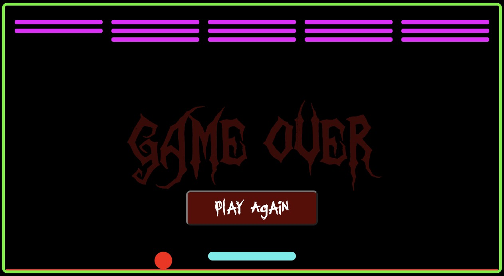

## Brick!
#### This is a remake of the classic iPod game, brick. The aim of the game is to use a paddle to bounce a ball without letting it touch the floor, until it destroys all the blocks on the ceiling. 

## Setup
1. Download zip file and extract
2. Open index.html with your browser

### Features ToDo

- Allow user to adjust speed/difficulty
- Improve UI design
- Store complete game state in an object
- Add logic for interaction with side of block

